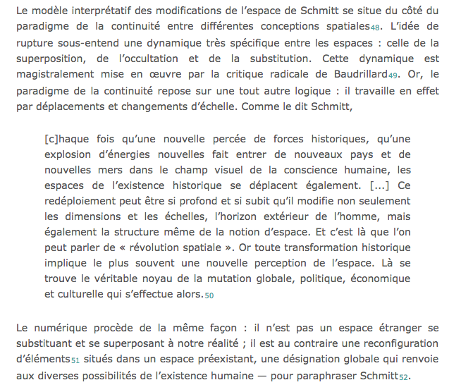
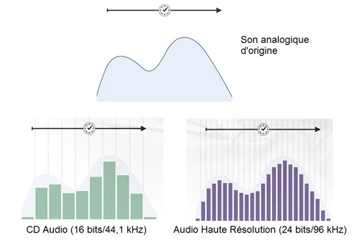
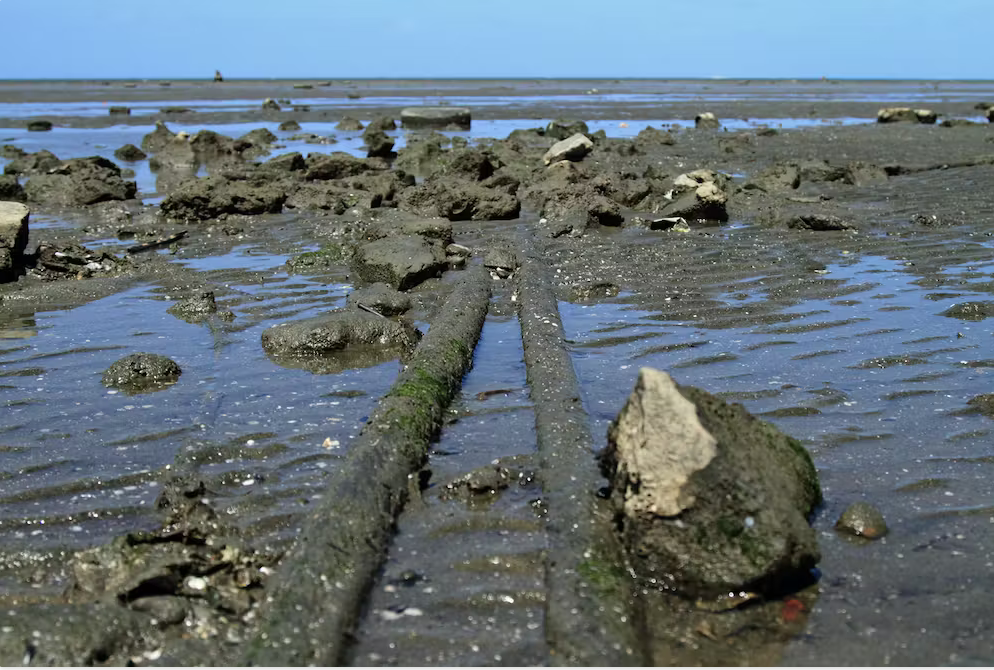
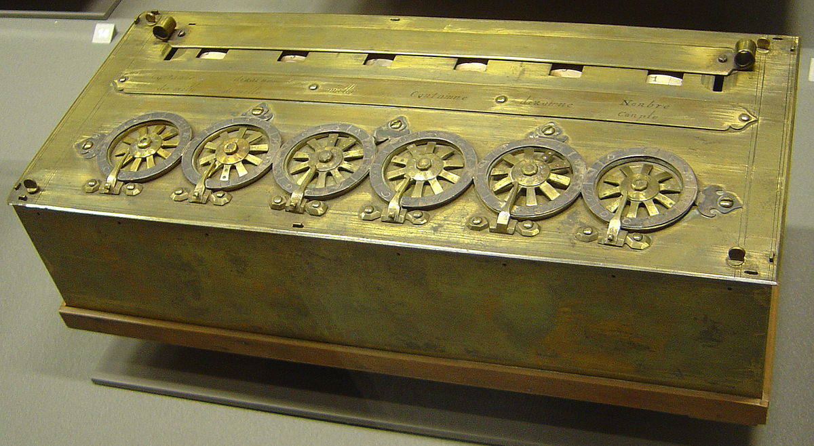
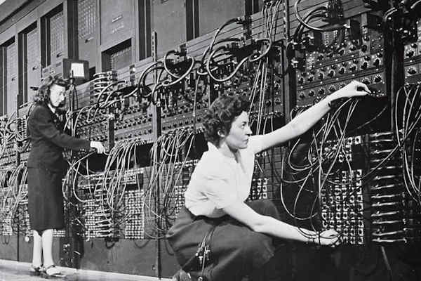
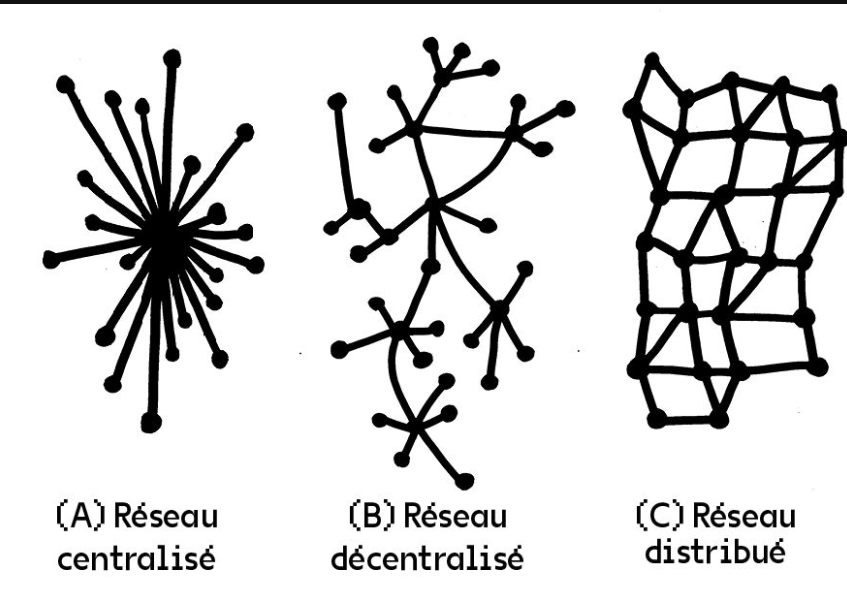

 
 
# Culture numérique
## CUN 1001
 
###### Enrico Agostini Marchese
<small>enrico.agostini.marchese@uqtr.ca</small>
 
_UQTR_
 
 
<small>HIVER 2024</small>

%%%%%%%%%%%%%%%%%%%%%%%%%%%%%%%%%%%%%%%%%%%%%

<h2>CALENDRIER</h2>
<ul>
<li>15 janvier : <b>Introduction</b></li>
<li>22 janvier : <b>Culture numérique 1 : définition, enjeux et approches</b></li>
<li>29 janvier : <b>Culture numérique 2 : histoire  de l'informatique et du numérique</b></li>
<li>5 février :  <b>Les humanités numériques et conférence : « L'édition numérique »</b></li>
<li>12 février : <b>Littérature numérique 1 : définition, enjeux et approches</b></li>
<li>19 février : <b>Littérature numérique 2 : histoire et perspectives</b></li>
<li>26 février : <b>Examen sur table</b></li>
<li>11 mars : <b>Autorité et pouvoir à l'époque numérique</b></li>
<li>18 mars : <b>Culture numérique, culture participative et conférence « Les pratiques de médiation culturelle en contexte numérique »</b></li>
<li>25 mars : <b>La géolocalisation comme paradigme culturel</b></li>
<li>8 avril : <b>Études de genre, théorique queer et numérique</b></li>
<li>15 avril : <b>La « plateformisation » des environnements numériques</b></li>
<li>22 avril : <b>Présentations orales</b></li>
<li>29 avril : <b>Présentations orales</b></li>
<li>6 mai : <b>Remise travail final</b></li>
</ul>

§§§§§§§§§§§§§§§§§§§§§§§§§§§§§§§§§§§§§§§§§§§§§

### EXAMEN SUR TABLE
4 questions sur les séances précédentes (théories, approches, histoire, cas d'étude, etc.)
 
 
1 page par question
 
 
ÉVALUATION - 20% de la note finale
 
 
Critères d'évaluation dans le plan du cours

§§§§§§§§§§§§§§§§§§§§§§§§§§§§§§§§§§§§§§§§§§§§§

### Présentation orale des textes théoriques
10-15 minutes de présentation du texte à lire pour la séance
 
<ul>
<li>Résumé du texte</li>
<li>Présentation des thèmes centraux</li>
<li>Ouverture des pistes de discussion en classe</li>
</ul>
 
 
ÉVALUATION - 20% de la note finale
 
 
Critères d'évaluation dans le plan du cours

§§§§§§§§§§§§§§§§§§§§§§§§§§§§§§§§§§§§§§§§§§§§§

### Présentation du travail final
20 minutes de présentation de l'ébauche du travail final
 
<ul>
<li>Présentation du cas d'étude</li>
<li>Présentation de la question de recherche</li>
<li>Présentation de la méthodologie</li>
<li>Présentation de l'analyse</li>
</ul>
 
 
ÉVALUATION - 20% de la note finale
 
 
Critères d'évaluation dans le plan du cours

§§§§§§§§§§§§§§§§§§§§§§§§§§§§§§§§§§§§§§§§§§§§§

### TRAVAIL FINAL
Analyse d'un phénomène numérique
 
 
2 500 mots
 
 
Présentation du cas d’étude
- Présentation de la question de recherche
- Présentation de la méthodologie
- Déroulement de l’analyse
- Conclusion

ÉVALUATION - 40% de la note finale

%%%%%%%%%%%%%%%%%%%%%%%%%%%%%%%%%%%%%%%%%%%%%

### PLAGIAT
<small>
« Le plagiat est l'acte de faire passer pour siens les textes ou les idées d’autrui »
 
 
- copier ou essayer de copier de quelque façon lors d'un examen ou d'une épreuve;
- chercher frauduleusement à connaître ou obtenir les questions ou les solutions relatives à un examen ou à une épreuve;
- présenter dans ses travaux écrits un même texte à des professeur·e·s, chargés de cours ou équipes pédagogiques différents sans avoir préalablement reçu l'approbation de chacun d'eux par écrit;
- utiliser totalement ou en partie du texte d'autrui en le faisant passer pour sien ou sans en indiquer les références;
- falsifier ou chercher à falsifier des documents à caractère scolaire (dossier scolaire, fiche d'inscription, bordereaux de transmission de notes ou autres);
- participer, tenter de participer à une substitution de personnes lors d'un examen ou d'un travail faisant l'objet d'une évaluation;
- posséder ou utiliser pendant un examen tout document ou matériel non autorisé;
- utiliser à des fins illicites les ressources informatiques de l'Université.   
https://oraprdnt.uqtr.uquebec.ca/pls/public/gscw031?owa_no_site=76&owa_no_fiche=142
</small>

§§§§§§§§§§§§§§§§§§§§§§§§§§§§§§§§§§§§§§§§§§§§§

### NORMES DE CITATION

2 styles principaux :
<ul>
<li>Auteur-date</li>
<li>Classique</li>
</ul>

§§§§§§§§§§§§§§§§§§§§§§§§§§§§§§§§§§§§§§§§§§§§§

### Auteur-date

Dans le corps du texte, pas de note de bas de page
 
 
(Auteur date, page)
 
 
Je pense que l'incipit d'<i>Aurélien</i> de Louis Aragon, « La première fois qu'Aurélien vit Bérénice, il la trouva franchement laide » (Aragon 1976, 5), est le plus bel incipit de la littérature française.
 
 
À la fin du livre ou de l'article : index des auteur.e.s cité.e.s

§§§§§§§§§§§§§§§§§§§§§§§§§§§§§§§§§§§§§§§§§§§§§

### Classique
Notes de bas de page
 
 
Je pense que l'incipit d'<i>Aurélien</i> de Louis Aragon, « La première fois qu'Aurélien vit Bérénice, il la trouva franchement laide »<small>1</small>, est le plus bel incipit de la littérature française.
 
 
 
 
<small>1 Louis Aragon, <i>Aurélien</i>, Paris, Gallimard, 1976, p. 5.</small>

§§§§§§§§§§§§§§§§§§§§§§§§§§§§§§§§§§§§§§§§§§§§§

### Classique
Reproduire la citation intégrale entre guillemets, avec la ponctuation et même, le cas où, les fautes, suivie de [<i>sic</i>]
 
 
Le prof, dans ses diapositives, a écrit : « les fautes, suivie [<i>sic</i>] » au lieu de « suivies. »
 
 
Dans le cas d'une citation de quatre lignes ou plus - dite citation longue - il faut l'insérer comme paragraphe autonome, sans guillements ni italique, avec la même police mais de taille diminuée et interligne simple et avec mise en retrait.

§§§§§§§§§§§§§§§§§§§§§§§§§§§§§§§§§§§§§§§§§§§§§

§§§§§§§§§§§§§§§§§§§§§§§§§§§§§§§§§§§§§§§§§§§§§

### Classique - Citation dans une citation

On utilise les guillemets anglais : "..."

Le prof a dit qu'il « pense que l'incipit d'<i>Aurélien</i> de Louis Aragon, "La première fois qu'Aurélien vit Bérénice, il la trouva franchement laide"<small>1</small>, est le plus bel incipit de la littérature française. »

§§§§§§§§§§§§§§§§§§§§§§§§§§§§§§§§§§§§§§§§§§§§§

### Classique - Ajout et retrait

<small>Parfois, dans une citation, on a besoin de changer, ajouter ou enlever des choses. On rend manifeste toute intervention en utilisant les parenthèses carrées : [ ]
 
 

« le roman-feuilleton du XIXe siècle [est][…] au contraire l’origine du grand roman “original” à la manière de Balzac ou de Dostoïevski ; et qu’en outre le roman-feuilleton dans le style des <i>Mystères de Paris</i> développe une nouvelle mythologie de la civilisation urbaine<small>1</small> »

 1 Hans Robert Jauss, <i>Pour une esthétique de la réception</i>, Paris, Gallimard, 1978, p. 120.
  
Quand on veut mettre en évidence des mots dans la citation, on utilise <b>dans la citation</b> l'italique et on ajoute à la note de bas de page <i>(C'est moi qui souligne)</i>
 
 
« le roman-feuilleton du XIXe siècle [est][…] au contraire l’origine du <i>grand</i> roman “original” à la manière de Balzac ou de Dostoïevski<small>1</small> »
 
 1 Hans Robert Jauss, <i>Pour une esthétique de la réception</i>, Paris, Gallimard, 1978, p. 120. (C'est moi qui souligne)
</small>

§§§§§§§§§§§§§§§§§§§§§§§§§§§§§§§§§§§§§§§§§§§§§

### Classique - Ajout et retrait II

<small>Les parenthèses carrées sont utilisées aussi pour préciser des éléments de la citation ou pour introduire la citation elle-même.
 
 
« dans cette province francophone du Canada [le Québec], il y a 8 millions d'habitants »
 
 
« La première fois qu'Aurélien vit Bérénice, il la trouva franchement laide », incipit d'<i>Aurélien</i> de Louis Aragon, est à mon avis le plus bel incipit de la littérature française.
 
 
Je pense que l'incipit d'<i>Aurélien</i> de Louis Aragon, « [l]a première fois qu'Aurélien vit Bérénice, il la trouva franchement laide », est le plus bel incipit de la littérature française.
 
 
« [...] il la trouva franchement laide » c'est la phrase qui fait de l'incipit d'<i>Aurélien</i> de Louis Aragon le plus bel incipit de la littérature française</small>

§§§§§§§§§§§§§§§§§§§§§§§§§§§§§§§§§§§§§§§§§§§§§

#### Classique - Monographies et livres
<small>
<ul>
<li>Un auteur : Prénom Nom, <i>Titre</i>, lieu de publication, maison d'édition, année, page.</li>
<li>Deux auteurs : Prénom1 Nom1 et Prénom2 Nom2, <i>Titre</i>, lieu de publication, maison d'édition, année, page.</li>
<li>Trois auteurs : Prénom1 Nom1, Prénom2 Nom2 et Prénom3 Nom3, <i>Titre</i>, lieu de publication, maison d'édition, année, page.</li>
<li>Quatre auteurs ou plus : Prénom1 Nom1 et autres, <i>Titre</i>, lieu de publication, maison d'édition, année, page.</li>
<li>Collectif/Entité collective : Nom du collectif, <i>Titre</i>, lieu de publication, maison d'édition, année, page.</li>
<li>Ouvrage collectif dirigé par une personne : Prénom Nom (dir.), <i>Titre</i>, lieu de publication, maison d'édition, année, page.</li>
<li>Entrée d'encyclopédie, dictionnaire ou autre entrée <b>sans auteur</b> : « entrée », entrée de <i>Titre</i>, lieu de publication, maison d'édition, année, page.</li>
<li> Thèse et mémoire : Prénom Nom, <i>Titre</i>, thèse (Ph.D.)/mémoire en ..., Université, année, page.</li>
</ul>
</small>

§§§§§§§§§§§§§§§§§§§§§§§§§§§§§§§§§§§§§§§§§§§§§

### Classique - Chapitres, parties de livres et articles
<small>
<ul>
<li>Un auteur : Prénom Nom, « Titre du chapitre », dans Prénom Nom de l'auteur, <i>Titre</i>, lieu de publication, maison d'édition, année, page.</li>
<li>Un auteur dans un ouvrage collectif : Prénom Nom, « Titre du chapitre », dans Prénom Nom du directeur (dir.), <i>Titre</i>, lieu de publication, maison d'édition, année, page.</li>
<li>Entrée d'encyclopédie, dictionnaire ou autre entrée <b>avec auteur</b> : Prénom Nom, « entrée », dans <i>Titre</i>, lieu de publication, maison d'édition, année, page.</li>
<li>Auteur d'un article : Prénom Nom, « Titre de l’article :
sous-titre », <i>titre de la revue : sous-titre</i>, dossier spécial, volume, numéro, jour
mois, année, page.</li>
</ul>
</small>

§§§§§§§§§§§§§§§§§§§§§§§§§§§§§§§§§§§§§§§§§§§§§

### Classique - Documents numériques
<ul>
<li>Site Web <b>sans auteur</b> : <i>Nom du site</i>. [En ligne : adresse] (consulté le jj/mm/aaaa)</li>
<li>Site Web <b>avec auteur</b> : Prénom Nom, <i>Nom du site</i>. [En ligne : adresse] (consulté le jj/mm/aaaa)</li>
<li>Page d'un site Web <b>sans auteur</b> : « nom de la page » dans <i>nom du site</i>. [En ligne : adresse] (consulté le jj/mm/aaaa)</li>
<li>Page d'un site Web <b>avec auteur</b> : Prénom Nom, « nom de la page » dans <i>nom du site</i>. [En ligne : adresse] (consulté le jj/mm/aaaa)</li>
</ul>

§§§§§§§§§§§§§§§§§§§§§§§§§§§§§§§§§§§§§§§§§§§§§

### Classique - Documents numériques II
<small>
<ul>
<li>Un auteur : Prénom Nom, <i>Titre</i>, lieu de publication, maison d'édition, année, page. [En ligne : adresse] (consulté le jj/mm/aaaa)</li>
<li>Collectif/Entité collective : Nom du collectif, <i>Titre</i>, lieu de publication, maison d'édition, année, page.</li>
<li>Ouvrage collectif dirigé par une personne : Prénom Nom (dir.), <i>Titre</i>, lieu de publication, maison d'édition, année, page. [En ligne : adresse] (consulté le jj/mm/aaaa)</li>
<li>Entrée d'encyclopédie, dictionnaire ou autre entrée <b>sans auteur</b> : « entrée », entrée de <i>Titre</i>, lieu de publication, maison d'édition, année, page. [En ligne : adresse] (consulté le jj/mm/aaaa)</li>
<li> Thèse et mémoire : Prénom Nom, <i>Titre</i>, thèse (Ph.D.)/mémoire en ..., Université, année, page. [En ligne : adresse] (consulté le jj/mm/aaaa)</li>
<li>Auteur d'un article : Prénom Nom, « Titre de l’article :
sous-titre », <i>titre de la revue : sous-titre</i>, volume, numéro, jour
mois année, page, doi. [En ligne : adresse] (consulté le jj/mm/aaaa)</li>
</ul>
</small>

§§§§§§§§§§§§§§§§§§§§§§§§§§§§§§§§§§§§§§§§§§§§§

#### Classique - Documents numérique III
<small>
<ul>
<li>Ebook : Prénom Nom, <i>Titre</i>, lieu de publication, maison d'édition, année, page <b>ou</b> [Édition numérique consultée non paginée].</li>
<li>Billet de blog : Prénom Nom, « titre du billet »/billet sans nom dans <i>titre du blog</i>, publié le jj/mm/aaaa. [En ligne : adresse] (consulté le jj/mm/aaaa)</li>
<li>Tweet : Prénom Nom (nom Twitter), Billet Twitter, publié le jj/mm/aaaa (consulté le jj/mm/aaaa)</li>
<li>Billet Facebook : Nom usager, Billet Facebook, publié le jj/mm/aaaa (consulté le jj/mm/aaaa)</li>
<li>Vidéo YouTube : Nom usager, « titre de la vidéo », Vidéo YouTube. [En ligne : adresse] (consulté le jj/mm/aaaa)</li>
<li>Application : auteur/compagnie, <i>Nom de l'application</i>, téléchargeable/disponible pour iOS/Android, version actuelle, année.</li>
<li>Entrée d'encyclopédie, dictionnaire ou autre entrée <b>sans auteur</b> : « entrée », entrée <i>Titre</i>. [En ligne : adresse] (consulté le jj/mm/aaaa)</li>
</ul>
</small>

§§§§§§§§§§§§§§§§§§§§§§§§§§§§§§§§§§§§§§§§§§§§§

### Abréviations
<small>
<ul>
<li>Citer le même auteur pour la deuxième fois : Hans Robert Jauss --> H.S. Jauss</li>
<li>Citer le même document pour la deuxième fois : P. Nom, <i>titre</i>/« titre », op. cit., page</li>
<li>Ibid. : pour citer le même document de la note précédente</li>
<li>Cf. : voir. Pour indiquer de façon générale un document à consulter</li>
</ul>
</small>

§§§§§§§§§§§§§§§§§§§§§§§§§§§§§§§§§§§§§§§§§§§§§

### Bibliographie
<small>
Différencier les sections selon le type de document : bibliographie, webographie, vidéographie, ...
 
 
Inverser Prénom et nom et enlever les indications des pages, dates de consultation, ... :
<ul>
<li>NOM, Prénom de l'auteur, <i>Titre</i>, lieu de publication, maison d'édition, année.</li>
<li>Pour les articles : NOM, Prénom, « Titre de l’article :
sous-titre », <i>titre de la revue : sous-titre</i>, volume, numéro, jour
mois année, <b>pages</b>.</li>
<li>NOM, Prénom, <i>Titre</i>, lieu de publication, maison d'édition, année. [En ligne : adresse]</li>
</small>
%%%%%%%%%%%%%%%%%%%%%%%%%%%%%%%%%%%%%%%%%%%%%

# Écriture inclusive

§§§§§§§§§§§§§§§§§§§§§§§§§§§§§§§§§§§§§§§§§§§§§

Écriture inclusive :

- Épicène (la plus inclusive)
- Féminisation
- Non binaire

§§§§§§§§§§§§§§§§§§§§§§§§§§§§§§§§§§§§§§§§§§§§§

# Pourquoi ?

<small>

>« [Le] genre masculin est réputé plus noble que le féminin, à cause de la supériorité du mâle sur la femelle »

1767, Nicolas Beauzée, grammairien français, membre de l'Académie française

>« Quoiqu'il y ait un grand nombre de femmes qui professent, qui gravent, qui composent, qui traduisent, etc. on ne dit pas professeuse, graveuse, compositrice, traductrice, etc. mais bien professeur, graveur, compositeur, traducteur, etc., par la raison que ces mots n'ont été inventés que pour les hommes qui exercent ces professions»

1843, Louis Nicolas Bescherelle, grammairien français

</small>

§§§§§§§§§§§§§§§§§§§§§§§§§§§§§§§§§§§§§§§§§§§§§

## Épicène

Rédaction où l'on ne perçoit pas de noms genrés qui désignent des personnes.

Contrairement à la féminisation, elle permet une meilleure inclusion entre autres de la diversité de genre, en n'opposant pas les genres grammaticaux

- Attrait principal : inclusivité générale
- Inconvenient majeur : reformulation complète des phrases et admet difficilement la reprise par pronom

§§§§§§§§§§§§§§§§§§§§§§§§§§§§§§§§§§§§§§§§§§§§§

# Mots épicènes

- Les expert·e·s -> Les spécialistes
- Les invité·e·s -> Les convives
- Les organisateurs·rices -> Les responsables de l'organisation

§§§§§§§§§§§§§§§§§§§§§§§§§§§§§§§§§§§§§§§§§§§§§

### Noms communs à genre grammatical fixe

- L'acteur·rice -> La vedette
- Notre nouvel·le employé·e -> La nouvelle recrue

§§§§§§§§§§§§§§§§§§§§§§§§§§§§§§§§§§§§§§§§§§§§§

## Les nomes neutres

- Lecteurs·rices -> Le lectorat
- Clients·es -> Clientèle
- Spectateur·rice -> Le public

§§§§§§§§§§§§§§§§§§§§§§§§§§§§§§§§§§§§§§§§§§§§§

## Les noms généraux

- Les immigrant·e·s -> Les personnes issues de l'immigration
- Les citoyen·ne·s -> Les gens du quartier

§§§§§§§§§§§§§§§§§§§§§§§§§§§§§§§§§§§§§§§§§§§§§

## La catégorie de mots

- Les étudiant·e·s -> La communauté étudiante
- L'intérêt des lecteurs·rices -> L'intérêt littéraire

§§§§§§§§§§§§§§§§§§§§§§§§§§§§§§§§§§§§§§§§§§§§§

## Les temps et voix verbales

- Si vous êtes inscrit·e·s -> Si vous avez fait votre inscription
- Les spécialistes sont invité·e·s -> Nous invitions les spécialistes

§§§§§§§§§§§§§§§§§§§§§§§§§§§§§§§§§§§§§§§§§§§§§

## Reformulation syntaxique

- Un.e secrétaire -> À titre de secrétaire
- Quant à eux·lles -> Pour leur part
- Tou·te·s les membres -> La totalité des membres

§§§§§§§§§§§§§§§§§§§§§§§§§§§§§§§§§§§§§§§§§§§§§

## Synonymes

- Charmant·e·s -> Aimables
- Attentif·ve·s -> À l'écoute

§§§§§§§§§§§§§§§§§§§§§§§§§§§§§§§§§§§§§§§§§§§§§

## Problèmes

- Lecteur·rice vs lectorat
- Élèves vs étudiant·e·s
- Maire vs Mairie
- Cheffe : d'abord masculin, il a été féminisé pour souci politique
- Individue : on s'en tiendra au nom masculin

§§§§§§§§§§§§§§§§§§§§§§§§§§§§§§§§§§§§§§§§§§§§§

## Féminisation

On vise un équilibre lexical entre les femmes et les hommes ainsi qu'une réhabilitation des termes qui désignent les femmes

- Attrait principal : revisibilisation des femmes
- Inconvenient majeur : découle de la binarité de genre

§§§§§§§§§§§§§§§§§§§§§§§§§§§§§§§§§§§§§§§§§§§§§

## Féminisation

- Client et cliente -> client·e·s
- Indécis et indécises -> indécis·es
- Beaux et belles -> bel·le·s / beaux·lles
- Infirmier et infirmière -> infirmier·ère

§§§§§§§§§§§§§§§§§§§§§§§§§§§§§§§§§§§§§§§§§§§§§

## Doubles lexicaux

- Conseillers et conseillères / conseillères et conseillers

« Obligatoire » dans les cas de formation irrégulière

- Neveu et nièce
- Empereur et impératrice
- Oncle et tante

§§§§§§§§§§§§§§§§§§§§§§§§§§§§§§§§§§§§§§§§§§§§§

## -eure

Invention québécoise des années 1970 pour décrire des métiers au féminin

- Pasteure
- Professeure
- Ingénieure
- Auteure, autrice, auteuresse

§§§§§§§§§§§§§§§§§§§§§§§§§§§§§§§§§§§§§§§§§§§§§

## -euse

- si le nom dérive d'un verbe : chercher -> chercheuse
- si le nom dérive d'un autre nom : chronique -> chroniqueuse
- si le nom dérive d'un nom anglais : basket-ball -> basket-balleuse

§§§§§§§§§§§§§§§§§§§§§§§§§§§§§§§§§§§§§§§§§§§§§

## Accord

- De majorité :  les infirmières -> mes ami·e·s sont heureuses
- De proximité (en français jusqu'au XVIIIe siècle): le participe prend le genre du dernier nom utilisé -> les étudiants et les étudiantes sont heureuses

§§§§§§§§§§§§§§§§§§§§§§§§§§§§§§§§§§§§§§§§§§§§§

## Non binaire

On n'assigne pas de genre aux termes qui désignent des personnes. Écriture très fluide, nouvelle, parfois sans règles, ne faisant pas un consensus absolu : elle dépend beaucoup de l'intention de la personne l'utilisant

- Attrait principal : représentation de la diversité de genre
- Inconvenient majeur : lexique qui peut porter atteinte à la catégorisation, cruciale dans certaines études scientifiques, et compréhension du texte plus difficile pour les personnes non initiées ou avec difficultés de lecture

§§§§§§§§§§§§§§§§§§§§§§§§§§§§§§§§§§§§§§§§§§§§§

## Pronoms sujets

- Iel, ille, el, ol, ul, ael, etc.
- Iels -> iels, ille -> illes

§§§§§§§§§§§§§§§§§§§§§§§§§§§§§§§§§§§§§§§§§§§§§

## Pronoms personnels, démonstratifs et indéfinis

- Celle/celui, celles/ceux -> cellui, celleux, ceuzes
- Elle/lui, elles/eux -> ellui, elleux
- Toutes/tous -> Toustes, touz

§§§§§§§§§§§§§§§§§§§§§§§§§§§§§§§§§§§§§§§§§§§§§

## Déterminants

- Le/la -> lea, lo, lia, lu
- Ma/mon -> Maon
- Ta/ton -> Taon, tan
- Sa/son -> Saon, san
- Une/un -> Um, an
- De la/du -> Do

§§§§§§§§§§§§§§§§§§§§§§§§§§§§§§§§§§§§§§§§§§§§§

## Adjectifs

- Belle/beau -> Belleau
- Heureuse/heureux -> heureuxe

§§§§§§§§§§§§§§§§§§§§§§§§§§§§§§§§§§§§§§§§§§§§§

## Noms communs

- Amie/ami -> amix
- Autrice/auteur -> auteurice, auteurix
- Étudiante/étudiant -> étudiant*
- Sœur/frère -> frœur, freure, adelphe
- Madame/monsieur -> Damoixe, mixe, mx
- Professionnelle/professionnel -> professionèle
- Travailleuse/travailleur -> travailleureuse

%%%%%%%%%%%%%%%%%%%%%%%%%%%%%%%%%%%%%%%%%%%%%
# Qu'est-ce que la _culture_ numérique ?

%%%%%%%%%%%%%%%%%%%%%%%%%%%%%%%%%%%%%%%%%%%%%
# Vocabulaire du numérique
§§§§§§§§§§§§§§§§§§§§§§§§§§§§§§§§§§§§§§§§§§§§§

## Numérique et analogique

§§§§§§§§§§§§§§§§§§§§§§§§§§§§§§§§§§§§§§§§§§§§§

## Numérique et analogique

- Analogique : signal continu, perte de qualité à chaque transmission, stockage et reproduction coûteuses
- Numérique : signal discret, qualité immuable, moins coûteux, dépend du format

§§§§§§§§§§§§§§§§§§§§§§§§§§§§§§§§§§§§§§§§§§§§§

## Internet n'est pas le Web

Internet est un réseau d'infrastructure mettant en communication des ordinateurs, basé sur un protocole de communication, appelé TCP/IP

- Transmission Control Protocol, Vincent Cerf et Bob Kahn, 1973 : régit la transmission de l'information (three-way handshake et four-way handshake)
- Internet Protocol, Vincent Cerf : régit la segmentation de l'information et la recomposition

Internet sont les satellites, les câble sous-marins : Internet est _matériel_

Protocole non fiable : les paquets ne sont pas en ordre chronologique, ne garantit pas la non-corruption, perte ou destruction ou la duplication des paquets

§§§§§§§§§§§§§§§§§§§§§§§§§§§§§§§§§§§§§§§§§§§§§

<small>© Map Data</small>

<a href="http://surfacing.in/">http://surfacing.in/</a>

§§§§§§§§§§§§§§§§§§§§§§§§§§§§§§§§§§§§§§§§§§§§§

<small>Nicole Starosielski, CC BY-ND</small>

§§§§§§§§§§§§§§§§§§§§§§§§§§§§§§§§§§§§§§§§§§§§§

## Le Web n'est pas Internet

1990, Tim Berners-Lee : protocole de communication permettant de relier entre elles des pages, via un système d'adresse dit _hyperlien_.

Présence d'autres usages internet : mail (smtp), partage de fichier (ftp, peer-to-peer), messagerie instantanée, etc.

%%%%%%%%%%%%%%%%%%%%%%%%%%%%%%%%%%%%%%%%%%%%%

# Caractéristiques de la culture numérique

§§§§§§§§§§§§§§§§§§§§§§§§§§§§§§§§§§§§§§§§§§§§§

%%%%%%%%%%%%%%%%%%%%%%%%%%%%%%%%%%%%%%%%%%%%%
# Histoire de l'informatique

§§§§§§§§§§§§§§§§§§§§§§§§§§§§§§§§§§§§§§§§§§§§§

<small>Blaise Pascal, Pascaline, 1642
 © Wikipedia</small>

§§§§§§§§§§§§§§§§§§§§§§§§§§§§§§§§§§§§§§§§§§§§§

- 1642, Blaise Pascal, Pascaline : machine à calculer
- 1834, Charles Babbage : machine à calculer programmable (qui ne fonctionnera pas)
- 1843, Ada Lovelace : premier algorithme, première version d'une boucle conditionnelle
- 1854, Georges Boole, logique booléenne
- 1945, John Presper Eckert et John Mauchly, _ENIAC_ (Electronic numerical integrator and computer)

§§§§§§§§§§§§§§§§§§§§§§§§§§§§§§§§§§§§§§§§§§§§§

# Tur(n)ing point

1936, « _On Computable Numbers, with an Application to the Entscheidungsproblem_ », Alain Turing.

Bases théoriques d'une machine capable de tout calculer en décomposant l'information en deux valeurs, 0 et 1 — à la base du langage binaire de l'informatique

§§§§§§§§§§§§§§§§§§§§§§§§§§§§§§§§§§§§§§§§§§§§§

<small>ENIAC avait six programmatrices premières, appelées "opératrices" :
Kay McNulty, Betty Jennings, Betty Snyder, Marlyn Wescoff, Fran Bilas, and Ruth Lichterman.</small>
 
<small>Eniac   © Los Alamos national laboratory</small>

§§§§§§§§§§§§§§§§§§§§§§§§§§§§§§§§§§§§§§§§§§§§§

# 1940-1950

_Mainframe_ : ordinateur de grosse taille, très cher

Une informatique d'institutions

§§§§§§§§§§§§§§§§§§§§§§§§§§§§§§§§§§§§§§§§§§§§§

# 1960 : ARPA

Division de la NASA, chargée de recherche militaire et fondamentale, ayant pour but de rattraper le retard dans la conquête de l'espace : en 1957 les Russes envoient Laïka dans l'espace.

Financement massif de projets universitaires

1962, Paul Baran, "On Distributed Communication Network" : conception de la forme d'un réseau de communication. Distribué et non centralisé

§§§§§§§§§§§§§§§§§§§§§§§§§§§§§§§§§§§§§§§§§§§§§

# Réseau centralisé

Toute communication passe par le centre.

- Robuste, permet un système de communication de bonne qualité
- National, les frontières du réseau sont délimitées par la nationalité des nœuds
- Monétisable, chaque communication peut être tracée par le centre et facturée

Intelligent au centre, idiot à la périphérie

§§§§§§§§§§§§§§§§§§§§§§§§§§§§§§§§§§§§§§§§§§§§§

# Réseau distribué

La communication est découpée en petits paquets, qui sont envoyés dans le réseau et empruntent des voies dépendantes de la saturation des nœuds. Arrivés à destination, ils sont remis en ordre

- Qualité moins bonne, ce n'est pas sûr que tous les paquets arrivent à destination
- Pas de frontières
- Monétisation difficile, il n'y a pas de centre de supervision d'ensemble

Idiot au centre, intelligent à la périphérie

§§§§§§§§§§§§§§§§§§§§§§§§§§§§§§§§§§§§§§§§§§§§§

# Aujourd'hui

Réseau décentralisé : certains nœuds sont plus importants que d'autres

Ex. : nos ordinateurs connectés au serveur de l'université

§§§§§§§§§§§§§§§§§§§§§§§§§§§§§§§§§§§§§§§§§§§§§

# 1960 : ARPANET

- Impulsion politique et financière de l'armée et du complexe politico-militaire
- Idéaux libertaires et contre-culturels des pionniers·ères

Exemple Janis Joplin

%%%%%%%%%%%%%%%%%%%%%%%%%%%%%%%%%%%%%%%%%%%%%

# Pouvoir et autorité

§§§§§§§§§§§§§§§§§§§§§§§§§§§§§§§§§§§§§§§§§§§§§

- Logiciel propriétaire
- Open acces
- Logiciel libre -> culture hacking (to hack = bricoler) (naissance dans les 1970 au MIT)

- Licenses

§§§§§§§§§§§§§§§§§§§§§§§§§§§§§§§§§§§§§§§§§§§§§

- Culture collective et coopérative : il favorise l'intelligence collective, car il en le résultat (impossibilité de définir l'inventeur d'Internet)
- Bric-à-brac d'éléments (technologies, médias, outils, protocoles, etc.) développés pour des usages très spécifiques

Dans les années 60, personne ne cherchait à définir la propriété d'un programme informatique (logiciel) à l'aide de brevets ou de propriété intellectuelle

Les chercheurs échangent les programmes, améliorent ceux des autres et les partagent avec la communauté

C'est dans les années 1980 que des entreprises comprennent la valeur économique des logiciels et comment à en fermer l'accès, à les rendre payants -> une partie de la communauté s'en va vers le logiciel libre et ouvert

§§§§§§§§§§§§§§§§§§§§§§§§§§§§§§§§§§§§§§§§§§§§§

§§§§§§§§§§§§§§§§§§§§§§§§§§§§§§§§§§§§§§§§§§§§§

# Éthique hacker

- Curiosité : iel ne comprend pas pourquoi on lui interdit de comprendre comment fonctionne un outils technique, un logiciel => exploration, manipulation, etc.
- Liberté : iel croit que l'information doit être libre, accessible à toustes un.e chacun.e => connaissance ouverte
- Anti-autorité : iel se méfie de l'autorité et privilégie la décentralisation, l'autonomie
- Méritocratie : le.a hacker doit être jugé·e selon ses hacks, pas selon l'âge, le sexe, le diplôme, l'origine ethnique, etc.
- Déterminisme et esthétisme technologique : les ordinateurs améliorent la vie et peuvent produire des choses esthétiquement belles
